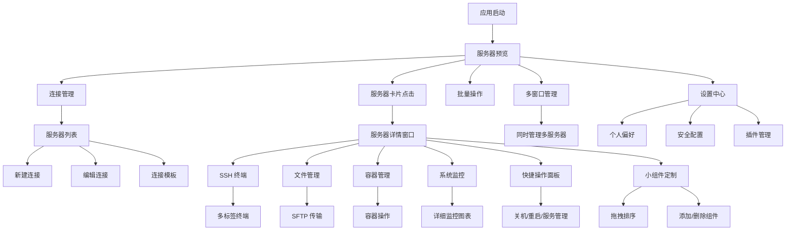

# Skylink SSH 软件产品需求文档

## 1. Product Overview

Skylink 是一个基于 Flutter 开发的现代化跨平台 SSH 客户端软件，集成了 AI 智能助手、容器管理、系统监控和数据同步等先进功能。该软件支持 Android、iOS、Windows、macOS 和 Linux 平台，为用户提供全方位的远程服务器管理解决方案。

* 解决传统 SSH 客户端功能单一、缺乏智能化的问题，提供集成化的服务器管理平台

* 面向开发者、DevOps 工程师、系统管理员和云服务使用者

* 通过 AI 辅助、可视化监控和自动化工具，大幅提升远程服务器管理效率和用户体验

## 2. Core Features

### 2.1 用户模式

本软件采用单一用户模式，无需注册或付费，所有用户均可使用完整功能：

- **本地存储**：所有数据存储在本地设备，保护用户隐私
- **完整功能**：SSH 连接、终端操作、文件传输、AI 助手、容器管理、系统监控
- **数据同步**：可选的 WebDAV 同步功能，用户自主配置
- **多语言支持**：基于 flutter_localizations + intl 的国际化架构

### 2.2 Feature Module

我们的现代化 SSH 客户端需求包含以下主要功能模块：

1. **服务器预览**: 服务器网格展示、实时系统指标、快速状态概览、批量操作
2. **服务器详情**: 详细仪表盘、可定制小组件、多窗口管理、快捷操作面板
3. **连接管理**: 服务器列表、分组管理、批量操作、连接模板
4. **SSH 终端**: 多标签终端、智能补全、命令历史、AI 辅助
5. **文件管理器**: SFTP 文件传输、可视化操作、批量上传下载
6. **容器管理**: Docker/Podman 容器操作、镜像管理、日志查看
7. **系统监控**: 实时性能监控、资源使用图表、告警通知
8. **AI 助手**: 命令建议、错误诊断、操作指南、自动化脚本
9. **快捷命令**: 命令模板、一键执行、自定义脚本、快捷键
10. **数据同步**: WebDAV 云端同步、多设备数据一致性、冲突解决
11. **设置中心**: 个人偏好、安全配置、主题定制、插件管理

### 2.3 Page Details

| Page Name | Module Name | Feature description                      |
| --------- | ----------- | ---------------------------------------- |
| 服务器预览     | 服务器网格       | 网格布局展示所有服务器，每个卡片显示CPU、内存、负载、磁盘占用百分比      |
| 服务器预览     | 实时监控指标      | 实时更新系统关键指标，颜色编码状态（绿色正常、黄色警告、红色异常）        |
| 服务器预览     | 快速操作        | 服务器卡片上的快捷按钮：连接、重启、关机、监控详情                |
| 服务器详情     | 详细仪表盘       | 点击服务器后打开新窗口，显示详细监控数据：网络上下行、接口信息、进程列表     |
| 服务器详情     | 可定制小组件      | 拖拽式小组件布局，支持添加/删除/排序：CPU图表、内存使用、磁盘IO、网络流量 |
| 服务器详情     | 快捷操作面板      | 自定义快捷按钮：关机、重启、服务管理、日志查看、文件传输             |
| 服务器详情     | 多窗口管理       | 支持同时打开多个服务器详情窗口，桌面端多窗口、移动端多任务切换          |
| 连接管理      | 服务器列表       | 服务器展示、搜索过滤、标签分组、批量选择                     |
| 连接管理      | 配置编辑        | 服务器参数配置、认证方式、跳板机设置                       |
| 连接管理      | 连接模板        | 预设配置模板、快速创建、参数继承                         |
| SSH 终端    | 多标签终端       | 同时管理多个 SSH 会话、标签切换                       |
| SSH 终端    | 智能补全        | AI 驱动的命令自动补全、参数提示                        |
| SSH 终端    | 命令历史        | 历史命令搜索、收藏、快速执行                           |
| 文件管理器     | SFTP 操作     | 文件上传下载、目录浏览、权限管理                         |
| 文件管理器     | 批量传输        | 多文件选择、进度显示、断点续传                          |
| 文件管理器     | 文件预览        | 文本文件在线编辑、图片预览                            |
| 容器管理      | 容器列表        | Docker/Podman 容器状态、操作控制                  |
| 容器管理      | 镜像管理        | 镜像列表、拉取推送、构建历史                           |
| 容器管理      | 日志查看        | 实时日志流、历史日志搜索、导出功能                        |
| 系统监控      | 性能图表        | CPU、内存、磁盘、网络实时监控图表                       |
| 系统监控      | 进程管理        | 进程列表、资源占用、进程控制                           |
| 系统监控      | 告警设置        | 阈值配置、通知规则、告警历史                           |
| AI 助手     | 命令建议        | 基于上下文的命令推荐、最佳实践                          |
| AI 助手     | 错误诊断        | 自动分析错误信息、提供解决方案                          |
| AI 助手     | 操作指南        | 任务导向的操作步骤、学习资源                           |
| 快捷命令      | 命令模板        | 自定义命令模板、参数化执行                            |
| 快捷命令      | 脚本管理        | 自动化脚本编辑、调度执行                             |
| 快捷命令      | 快捷键         | 自定义快捷键、手势操作                              |
| 数据同步      | WebDAV 配置   | 云存储连接、同步规则、冲突策略                          |
| 数据同步      | 同步状态        | 同步进度、版本历史、数据恢复                           |
| 设置中心      | 个人偏好        | 主题、字体、语言、布局定制                            |
| 设置中心      | 安全配置        | 密钥管理、加密设置、访问控制                           |
| 设置中心      | 插件管理        | 扩展插件、功能模块、更新管理                           |

## 3. Core Process

主要用户操作流程：

**新用户引导流程**：应用启动 → 欢迎页面 → 功能介绍 → 创建第一个连接 → 服务器预览介绍 → 开始使用

**日常使用流程**：服务器预览 → 查看实时指标 → 点击服务器打开详情窗口 → 多功能操作（终端/文件/容器/监控） → 多窗口管理

**高级用户流程**：批量服务器管理 → 自定义监控小组件 → 快捷操作配置 → 多窗口工作流 → 个性化设置

## 4. User Interface Design

### 4.1 Design Style

* **主色调**：深蓝色 (#0D47A1) 和科技蓝 (#1565C0)，体现专业性和科技感

* **辅助色**：成功绿 (#2E7D32)、警告橙 (#F57C00)、错误红 (#C62828)、AI 紫 (#7B1FA2)

* **按钮样式**：现代化扁平按钮，微妙圆角和渐变效果，支持深色/浅色主题自动切换

* **字体**：系统字体 + JetBrains Mono (终端)，支持多语言字体回退

* **布局风格**：现代化卡片式布局，简洁的侧边栏导航 + 多面板设计，支持拖拽调整

* **图标风格**：现代化线性图标 + 自定义 SSH/DevOps 图标，支持微动画效果

* **设计原则**：简洁扁平化设计、卡片式组件、现代化配色方案、流畅的交互动画

### 4.2 Page Design Overview

| Page Name | Module Name | UI Elements                               |
| --------- | ----------- | ----------------------------------------- |
| 服务器预览     | 服务器网格卡片     | 响应式网格布局，每个卡片显示服务器名称、IP、CPU/内存/负载/磁盘百分比环形图 |
| 服务器预览     | 状态指示器       | 实时状态灯（绿色在线、黄色警告、红色离线），数值颜色编码显示            |
| 服务器预览     | 快捷操作按钮      | 卡片悬浮显示操作按钮：连接、重启、关机、详情，支持长按菜单             |
| 服务器详情     | 多窗口容器       | 桌面端独立窗口、移动端全屏模式，支持窗口最小化、分屏显示              |
| 服务器详情     | 可定制仪表盘      | 网格布局的小组件系统，支持拖拽调整大小和位置，实时数据更新             |
| 服务器详情     | 快捷操作工具栏     | 顶部固定工具栏：关机、重启、终端、文件、容器、监控切换按钮             |
| 连接管理      | 服务器网格       | 响应式网格布局，服务器卡片支持拖拽、多选、右键菜单                 |
| 连接管理      | 侧边栏筛选       | 可折叠的筛选面板，标签云、分组树、搜索框组合                    |
| SSH 终端    | 多标签界面       | 顶部标签栏 + 终端区域，支持标签拖拽、分屏显示                  |
| SSH 终端    | 智能输入栏       | 底部命令输入框，AI 补全提示，历史命令快速选择                  |
| 文件管理器     | 双面板布局       | 左右分屏的文件浏览器，支持拖拽传输、进度显示                    |
| 文件管理器     | 工具栏         | 顶部操作工具栏，面包屑导航，批量操作按钮                      |
| 容器管理      | 容器列表        | 表格式布局，状态指示器，操作按钮组，实时状态更新                  |
| 容器管理      | 详情抽屉        | 右侧滑出的详情面板，日志流、配置信息、操作历史                   |
| 系统监控      | 图表仪表盘       | 响应式图表网格，实时数据可视化，支持时间范围选择                  |
| 系统监控      | 告警中心        | 通知列表 + 配置面板，支持规则编辑和历史查看                   |
| AI 助手     | 对话界面        | 聊天式交互界面，代码高亮，操作建议卡片                       |
| AI 助手     | 配置面板        | 模型选择、API 配置、功能开关的设置界面                     |
| 设置中心      | 分类导航        | 左侧分类树 + 右侧设置面板，支持搜索和快速定位                  |

### 4.3 Responsiveness

该产品采用自适应响应式设计，支持多设备无缝切换：

* **移动端 (< 768px)**：

  * 服务器预览：2列网格布局，底部导航，手势滑动切换

  * 服务器详情：全屏模式，底部标签栏，支持多任务后台切换

  * 小组件：垂直堆叠布局，触摸拖拽排序

* **平板端 (768px - 1200px)**：

  * 服务器预览：3-4列网格布局，侧边导航，分屏支持

  * 服务器详情：分屏模式，左侧预览右侧详情，触控笔优化

  * 小组件：2x2网格布局，支持悬浮窗口

* **桌面端 (> 1200px)**：

  * 服务器预览：4-6列网格布局，完整工具栏，键盘快捷键

  * 服务器详情：独立窗口，支持多窗口并行管理

  * 小组件：自由拖拽布局，支持窗口吸附和自动排列

* **超宽屏 (> 1920px)**：

  * 服务器预览：6-8列网格布局，信息密度优化

  * 服务器详情：多窗口平铺显示，专业工作流支持

  * 小组件：大尺寸图表显示，更多数据维度

* **横竖屏适配**：

  * 竖屏：垂直滚动布局，底部导航，单手操作优化

  * 横屏：水平布局，侧边导航，充分利用屏幕宽度

  * 自动旋转：布局平滑过渡，保持操作连续性

* **多窗口管理**：

  * 桌面端：原生多窗口支持，窗口拖拽、缩放、最小化

  * 移动端：任务切换器，后台保活，快速切换

  * 状态保持：窗口关闭后保存状态，重新打开恢复

* **交互优化**：支持键盘导航、鼠标右键菜单、触摸手势、语音输入等多种交互方式

* **无障碍支持**：屏幕阅读器兼容、高对比度模式、字体缩放、键盘导航

