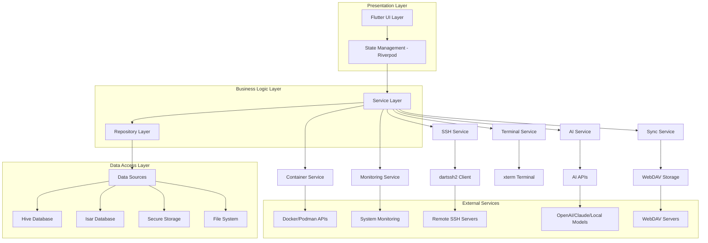
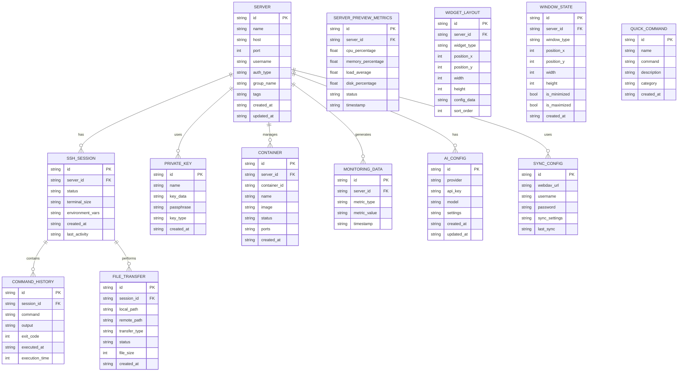

# Skylink SSH 软件技术架构文档

## 1. Architecture design



## 2. Technology Description

* **Frontend Framework**: Flutter\@3.24 + 现代化自定义UI组件库

* **State Management**: Riverpod\@2.4 (Provider pattern, dependency injection)

* **SSH Client**: dartssh2\@2.9 (SSH2 protocol, SFTP support)

* **Local Storage**: Hive\@2.2 (lightweight NoSQL) + Isar\@3.1 (complex queries)

* **Security**: flutter\_secure\_storage\@9.2 (encrypted key-value storage)

* **Terminal**: xterm\@3.5 (VT100/xterm terminal emulator)

* **AI Integration**: http\@1.1 (API clients for OpenAI/Claude/local models)

* **Data Sync**: webdav\_client\@1.2 (WebDAV protocol for cross-device sync)

* **File Transfer**: file\_picker\@6.1 + path\_provider\@2.1

* **Internationalization**: flutter\_localizations + intl\@0.19 (ARB-based localization)

* **UI Components**: flutter\_staggered\_grid\_view\@0.7 + animations\@2.0 + 自定义现代化组件库

* **Platform Integration**: window\_manager\@0.3 (desktop multi-window) + device\_info\_plus\@9.1

* **Multi-Window Support**: multiple\_windows\@1.0 (desktop) + flutter\_multi\_window\@0.2

* **Responsive Design**: flutter\_screenutil\@5.9 + responsive\_framework\@1.0 + 现代化响应式布局

* **Widget System**: flutter\_staggered\_grid\_view\@0.7 + reorderable\_grid\_view\@2.2

## 3. Route definitions

| Route                     | Purpose                                                   |
| ------------------------- | --------------------------------------------------------- |
| /                         | Server preview page, grid layout with real-time metrics   |
| /server/:id               | Server details window, customizable dashboard and widgets |
| /server/:id/terminal      | SSH terminal session for specific connection              |
| /server/:id/files         | File manager for specific connection                      |
| /connections              | Connection management, server list and configuration      |
| /connection/:id/edit      | Connection details, edit server configuration             |
| /files                    | File manager, SFTP file operations                        |
| /files/:connectionId      | File manager for specific connection                      |
| /containers               | Container management, Docker/Podman operations            |
| /containers/:connectionId | Container management for specific server                  |
| /monitoring               | System monitoring dashboard                               |
| /monitoring/:connectionId | Monitoring for specific server                            |
| /ai                       | AI assistant, command suggestions and error diagnosis     |
| /ai/config                | AI configuration, API keys and model settings             |
| /commands                 | Quick commands, template management                       |
| /sync                     | Data synchronization, WebDAV settings and status          |
| /settings                 | Application settings and preferences                      |
| /settings/security        | Security settings, key management                         |
| /settings/appearance      | Theme and UI customization                                |
| /settings/terminal        | Terminal appearance and behavior                          |
| /profile                  | User profile and account management                       |

## 4. Service Layer Architecture

### 4.1 Core Services

**SSH Service**

```dart
class SSHService {
  Future<SSHSession> connect(SSHConnection connection);
  Future<void> disconnect(String sessionId);
  Future<String> executeCommand(String sessionId, String command);
  Future<void> uploadFile(String sessionId, String localPath, String remotePath);
  Future<void> downloadFile(String sessionId, String remotePath, String localPath);
}
```

**AI Service**

```dart
class AIService {
  Future<List<CommandSuggestion>> getCommandSuggestions(CommandContext context);
  Future<ErrorDiagnosis> diagnoseError(String command, String error, CommandContext context);
  Future<List<AutoCompletionSuggestion>> getAutoCompletions(String input, CommandContext context);
  Future<OperationGuide> getOperationGuide(String task, CommandContext context);
}
```

**WebDAV Sync Service**

```dart
class SyncService {
  Future<void> uploadConfig(ConfigData data);
  Future<ConfigData> downloadConfig();
  Future<SyncStatus> checkSyncStatus();
  Future<void> resolveConflicts(List<ConflictItem> conflicts);
}
```

**Container Service**

```dart
class ContainerService {
  Future<List<Container>> listContainers(String sessionId);
  Future<void> startContainer(String sessionId, String containerId);
  Future<void> stopContainer(String sessionId, String containerId);
  Future<String> getContainerLogs(String sessionId, String containerId);
}
```

**Monitoring Service**

```dart
class MonitoringService {
  Stream<SystemMetrics> getSystemMetrics(String sessionId);
  Stream<ServerPreviewMetrics> getPreviewMetrics(String serverId);
  Future<List<Process>> getProcessList(String sessionId);
  Future<SystemInfo> getSystemInfo(String sessionId);
  Future<NetworkInterfaces> getNetworkInterfaces(String sessionId);
  Future<DiskUsage> getDiskUsage(String sessionId);
}
```

### 4.2 State Management with Riverpod

**Connection State Provider**

```dart
final connectionProvider = StateNotifierProvider<ConnectionNotifier, ConnectionState>(
  (ref) => ConnectionNotifier(ref.read(sshServiceProvider))
);
```

**AI Configuration Provider**

```dart
final aiConfigProvider = StateNotifierProvider<AIConfigNotifier, AIConfig>(
  (ref) => AIConfigNotifier(ref.read(storageServiceProvider))
);
```

**Terminal State Provider**

```dart
final terminalProvider = StateNotifierProvider.family<TerminalNotifier, TerminalState, String>(
  (ref, sessionId) => TerminalNotifier(sessionId, ref.read(sshServiceProvider))
);
```

**Multi-Window Management Provider**

```dart
final windowManagerProvider = StateNotifierProvider<WindowManagerNotifier, WindowManagerState>(
  (ref) => WindowManagerNotifier()
);

final serverDetailWindowProvider = StateNotifierProvider.family<ServerDetailWindowNotifier, ServerDetailWindowState, String>(
  (ref, serverId) => ServerDetailWindowNotifier(serverId, ref.read(windowManagerProvider.notifier))
);
```

**Widget Layout Provider**

```dart
final widgetLayoutProvider = StateNotifierProvider.family<WidgetLayoutNotifier, WidgetLayoutState, String>(
  (ref, serverId) => WidgetLayoutNotifier(serverId, ref.read(storageServiceProvider))
);
```

## 5. Data model

### 5.1 Data model definition



### 5.2 Data Definition Language

**Hive Models for Local Storage**

```dart
// App Settings Model (替代用户模型)
@HiveType(typeId: 0)
class AppSettings extends HiveObject {
  @HiveField(0)
  late String id;
  
  @HiveField(1)
  late String locale; // 当前语言设置
  
  @HiveField(2)
  late String themeMode; // 主题模式
  
  @HiveField(3)
  late Map<String, dynamic> preferences; // 用户偏好设置
  
  @HiveField(4)
  late DateTime createdAt;
  
  @HiveField(5)
  late DateTime updatedAt;
}

// Server Model
@HiveType(typeId: 1)
class Server extends HiveObject {
  @HiveField(0)
  late String id;
  
  @HiveField(1)
  late String name;
  
  @HiveField(2)
  late String host;
  
  @HiveField(3)
  late int port;
  
  @HiveField(4)
  late String username;
  
  @HiveField(5)
  late String authType; // password, privateKey, agent
  
  @HiveField(6)
  String? groupName;
  
  @HiveField(7)
  List<String>? tags;
  
  @HiveField(8)
  late DateTime createdAt;
  
  @HiveField(9)
  late DateTime updatedAt;
}

// AI Configuration Model
@HiveType(typeId: 2)
class AIConfig extends HiveObject {
  @HiveField(0)
  late String id;
  
  @HiveField(1)
  late String provider; // openai, claude, local, custom
  
  @HiveField(2)
  late String model;
  
  @HiveField(3)
  late Map<String, dynamic> settings;
  
  @HiveField(4)
  late bool enabled;
  
  @HiveField(5)
  late DateTime createdAt;
  
  @HiveField(6)
  late DateTime updatedAt;
}

// Sync Configuration Model
@HiveType(typeId: 3)
class SyncConfig extends HiveObject {
  @HiveField(0)
  late String id;
  
  @HiveField(1)
  late String webdavUrl;
  
  @HiveField(2)
  late String username;
  
  @HiveField(3)
  late bool autoSync;
  
  @HiveField(4)
  late int syncInterval; // minutes
  
  @HiveField(5)
  DateTime? lastSync;
  
  @HiveField(6)
  late Map<String, dynamic> syncSettings;
}

// Quick Command Model
@HiveType(typeId: 4)
class QuickCommand extends HiveObject {
  @HiveField(0)
  late String id;
  
  @HiveField(1)
  late String name;
  
  @HiveField(2)
  late String command;
  
  @HiveField(3)
  late String description;
  
  @HiveField(4)
  late String category;
  
  @HiveField(5)
  String? icon;
  
  @HiveField(6)
  String? shortcut;
  
  @HiveField(7)
  late bool confirmBeforeRun;
  
  @HiveField(8)
  late DateTime createdAt;
}

// Server Preview Metrics Model
@HiveType(typeId: 5)
class ServerPreviewMetrics extends HiveObject {
  @HiveField(0)
  late String id;
  
  @HiveField(1)
  late String serverId;
  
  @HiveField(2)
  late double cpuPercentage;
  
  @HiveField(3)
  late double memoryPercentage;
  
  @HiveField(4)
  late double loadAverage;
  
  @HiveField(5)
  late double diskPercentage;
  
  @HiveField(6)
  late String status; // online, warning, offline
  
  @HiveField(7)
  late DateTime timestamp;
}

// Widget Layout Model
@HiveType(typeId: 6)
class WidgetLayout extends HiveObject {
  @HiveField(0)
  late String id;
  
  @HiveField(1)
  late String serverId;
  
  @HiveField(2)
  late String widgetType; // cpu_chart, memory_usage, network_traffic, disk_io
  
  @HiveField(3)
  late int positionX;
  
  @HiveField(4)
  late int positionY;
  
  @HiveField(5)
  late int width;
  
  @HiveField(6)
  late int height;
  
  @HiveField(7)
  late Map<String, dynamic> configData;
  
  @HiveField(8)
  late int sortOrder;
}

// Window State Model
@HiveType(typeId: 7)
class WindowState extends HiveObject {
  @HiveField(0)
  late String id;
  
  @HiveField(1)
  late String serverId;
  
  @HiveField(2)
  late String windowType; // server_detail, terminal, file_manager
  
  @HiveField(3)
  late int positionX;
  
  @HiveField(4)
  late int positionY;
  
  @HiveField(5)
  late int width;
  
  @HiveField(6)
  late int height;
  
  @HiveField(7)
  late bool isMinimized;
  
  @HiveField(8)
  late bool isMaximized;
  
  @HiveField(9)
  late DateTime createdAt;
}
```

**多语言配置 (基于 flutter_server_box 架构)**

```dart
// l10n.yaml 配置文件
arb-dir: lib/l10n
template-arb-file: app_en.arb
output-localization-file: l10n.dart
output-class: AppLocalizations
output-dir: lib/generated/l10n
synthetic-package: false
untranslated-messages-file: untranslated.json

// pubspec.yaml 依赖配置
dependencies:
  flutter:
    sdk: flutter
  flutter_localizations:
    sdk: flutter
  intl: any

flutter:
  generate: true

// MaterialApp 配置
MaterialApp(
  localizationsDelegates: AppLocalizations.localizationsDelegates,
  supportedLocales: AppLocalizations.supportedLocales,
  locale: Stores.setting.locale.fetch().toLocale,
  localeListResolutionCallback: LocaleUtil.resolve,
  // ... 其他配置
)

// 支持的语言列表
supportedLocales: [
  Locale('en'),      // 英语
  Locale('zh'),      // 简体中文
  Locale('zh', 'TW'), // 繁体中文
  Locale('ja'),      // 日语
  Locale('ko'),      // 韩语
  Locale('fr'),      // 法语
  Locale('de'),      // 德语
  Locale('es'),      // 西班牙语
  Locale('ru'),      // 俄语
]

// ARB 文件示例 (app_en.arb)
{
  "@@locale": "en",
  "appTitle": "Skylink SSH",
  "serverPreview": "Server Preview",
  "connectToServer": "Connect to Server",
  "cpuUsage": "CPU Usage",
  "memoryUsage": "Memory Usage",
  "diskUsage": "Disk Usage",
  "loadAverage": "Load Average",
  "networkTraffic": "Network Traffic",
  "containerManagement": "Container Management",
  "aiAssistant": "AI Assistant",
  "fileManager": "File Manager",
  "systemMonitoring": "System Monitoring",
  "quickCommands": "Quick Commands",
  "settings": "Settings"
}
```

**Isar Models for Complex Queries**

```dart
// Command History with Isar for better search capabilities
@collection
class CommandHistory {
  Id id = Isar.autoIncrement;
  
  @Index()
  late String sessionId;
  
  @Index()
  late String command;
  
  late String output;
  
  late int exitCode;
  
  @Index()
  late DateTime executedAt;
  
  late int executionTime; // milliseconds
  
  @Index()
  List<String> tags = [];
}

// Monitoring Data with Isar for time-series queries
@collection
class MonitoringData {
  Id id = Isar.autoIncrement;
  
  @Index()
  late String serverId;
  
  @Index()
  late String metricType; // cpu, memory, disk, network
  
  late double metricValue;
  
  @Index()
  late DateTime timestamp;
  
  Map<String, dynamic> metadata = {};
}
```

